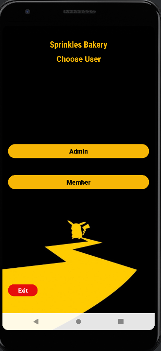

# Sprinkles Bakery Android Application

Sprinkles-Bakery is a feature-rich Android application designed with a futuristic and attractive user interface. The system enables seamless Cupcake ordering experiences while ensuring authentication and session management for different user roles.

## 🚀 Features

- **Two User Roles:**
  - **Admin:** Manages the system, cupcake categories, cupcakes, and member orders.
  - **Member:** View cupcakes based on categories, Order cupcakes, and manages orders.

- **Authentication & Security:**
  - Secure login for all users.
  - Registration for member users.
  - Session management for member usrs.

- **Futuristic UI/UX:**
  - Modern, sleek, and user-friendly design.
  - Responsive layout for a seamless experience across devices.

- **✅ (New!)**
  - **Update Cupcake Details (Admin):**  
    Admins can now edit existing cupcake entries including name, category, price, quantity, and image using a dedicated update interface.

- **✅ (New!)**
  - **Update Member Profile (Member):**  
    Members can now securely update their profile information such as name, email, and password. After a successful update, members are redirected to the login screen to re-authenticate.

## Screenshots


## 🛠️ Technologies Used

### **Frontend**
- **XML** – Structure and content

### **Backend**
- **Java** – Server-side logic and database interactions
- **Room** – Database management for storing cupcake category, caupcake, and order data.

### **Development Tools**
- **Android Studio** – Code editor

## 📌 Installation & Setup

1. Clone this repository:
   ```bash
   git clone https://github.com/Kalana-S/Sprinkles-Bakery-App.git
2. Open in Android Studio.
3. Build and run the application on an emulator or physical device. 

## Usage

1. Click the Admin  button to Use system as an admin.
2. Click the Member  button to Use system as an Member.
3. You can use the username **"admin"** and the password **"1234"** to log in to the system as an admin.
4. To log in to the system as a member, you should register first and then use the registered email and password.
5. This app allows the admin to create cupcake categories and cupcakes, as well as manage them and also manage orders.
6. Members can view cupcakes, filter cupcakes by category, place orders, and manage their own orders using this app.

## 🤝 Contribution

Contributions are welcome! If you'd like to improve the project, feel free to fork the repository and submit a pull request.

## 📜 License

This project is open-source and available under the **MIT License**.

---

💡 *Developed with passion using PHP, MySQL, HTML, CSS, and JavaScript!*


